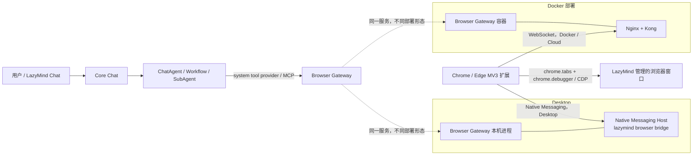

# LazyMind 浏览器自动化插件接入方案

> 状态：设计方案，尚未实现  
> 范围：Chrome / Edge（Manifest V3）、Docker 部署、LazyMind Desktop（macOS / Windows）  
> 目标：Agent 可以打开一个 URL，并在用户可见、可随时接管的浏览器页面中读取和执行点击、输入、选择、滚动、等待、截图等操作。

## 1. 结论

推荐采用 **“浏览器扩展 + Browser Gateway + LazyMind 内置浏览器工具协议”**，而不是让 Docker 或 Electron 直接接管用户正在使用的浏览器。

- 浏览器扩展运行在用户的 Chrome / Edge 中，负责创建一个由 LazyMind 管理的新窗口或标签页，并通过 `chrome.debugger` 使用 Chrome DevTools Protocol（CDP）操作页面。
- `browser-gateway` 负责设备配对、在线连接、会话路由、命令超时、审批和审计，并同时向 LazyMind Agent 暴露浏览器工具。
- Docker 侧由扩展主动通过 WebSocket 连接容器中的 Gateway。容器不能直接访问宿主机浏览器，这个边界不能靠 `host.docker.internal` 解决。
- Desktop 侧目标形态使用 Native Messaging 发现动态本地运行时并传输命令；首个开发版本可以先复用 loopback WebSocket，但正式 Desktop 验收应包含 Native Messaging，避免本地端口变化和跨域配置问题。
- Docker 中的 Playwright Chromium 仅作为自动化测试环境，以及后续可选的“托管无头浏览器”驱动，不代替产品态扩展。
- 页面由 React、Vue、Angular、Svelte 或传统服务端模板实现时，**不需要分别适配框架**。通用层操作 DOM、可访问性树和真实输入事件；只为富文本编辑器、Canvas 或特殊网站增加能力适配器。
- 对 Agent 框架也不做 LangChain、LlamaIndex、LazyLLM 等多套实现。内部统一使用一套工具协议，并通过 MCP / LazyMind Tool Provider 暴露。

建议先支持“扩展创建并管理的页面”，V1 不允许 Agent 静默接管用户原有标签页。这样既满足“打开 URL 后控制页面”，也能显著降低误操作和隐私风险。

## 2. 与 LazyMind 当前架构的衔接

仓库当前已经具备以下接入基础：

- Docker 前端默认暴露在 `8090`，由 Nginx 转发 `/api/*` 到 Kong。
- Local / Desktop 由 Caddy 转发到 `local-proxy`；Desktop 运行时仅绑定 `127.0.0.1`，端口可能动态分配。
- Core 的 Chat 请求已经支持注入 MCP 运行时配置，Python Chat 服务可以把 MCP Tool 加入 Agent。
- Desktop 已经通过 `local-runtime-manager` 统一启动、探活、停止和打包 Go / Python 服务。
- Electron 已有 preload IPC、安全外链、运行时状态和本地授权目录等能力，可复用其“显式授权 + 可撤销”的交互模式。

需要注意一个现有约束：`algorithm/lazymind/chat/service/chat_service.py` 在绑定 Workflow 的回合中会隐藏普通用户 MCP Tool。因此浏览器能力不能只作为一条普通 `mcp_config` 追加进去，否则普通对话能用，Workflow / SubAgent 中可能不可用。

建议增加不可由用户伪造的 `system_tool_providers`（或 `system_mcp_config`）通道：

1. 普通对话通过该通道加载第一方浏览器工具。
2. Workflow / SubAgent 仅在会话策略和步骤声明允许时加载第一方浏览器工具。
3. 普通用户 MCP 仍保持现有隔离规则，不因浏览器接入而扩大权限。

代码中应使用“browser extension / browser gateway / browser tool”命名，避免与仓库里代表 Workflow Runtime 的 `plugin_*` 表和 PluginSession 混淆。

## 3. 总体架构



关键原则：

- Agent 不直接持有 `tabId`、CSS Selector、Cookie 或 CDP 权限。
- Browser Gateway 只把经过校验的高层动作下发给扩展。
- 扩展内部也使用 CDP method allowlist，只调用实现高层动作所需的固定命令；明确拒绝 Cookie / Storage 导出、网络拦截和模型传入的任意 `Runtime.evaluate` 代码。
- 扩展只允许操作自己创建并登记过的窗口 / 标签页。
- 用户手工接管、关闭标签页、撤销设备或附加 DevTools 时，当前自动化会话立即暂停或结束。
- 页面内容一律视为不可信数据，不能把网页中的“忽略之前指令”等内容当作系统指令执行。

## 4. 为什么选择扩展 + CDP

| 方案 | 优点 | 问题 | 结论 |
|---|---|---|---|
| 仅 content script | 权限提示较轻，开发简单 | 合成事件不一定可信；跨域 iframe、复杂编辑器、Shadow DOM 和动态页面稳定性不足 | 不作为通用控制主驱动 |
| MV3 扩展 + `chrome.debugger` / CDP | 可访问 DOM、Accessibility、Input、Page、Runtime 等域，可产生真实鼠标键盘事件 | `debugger` 是高权限且不能声明为 optional；需要明确安装告知和严格审批 | **产品态主方案** |
| Docker Playwright 浏览器 | 自动化稳定、适合 CI 和无人值守 | 是容器里的独立浏览器，拿不到用户宿主机 Chrome 的登录态，用户不易接管 | 测试与后续无头模式 |
| Electron `webContents.debugger` / BrowserView | Desktop 内集成方便 | Desktop 独占，Docker 无法复用，并形成第二套驱动 | 不建议作为主方案 |

V1 建议最低支持 Chromium 125，以使用较完整的 CDP Target / iframe 会话能力；Chrome 和 Edge 使用同一套扩展代码、分别发布商店包。Firefox 不进入 V1，因为其调试接口和 CDP 行为不能直接等价复用。

### 4.1 扩展权限建议

Manifest V3 的必需权限控制在：

```json
{
  "manifest_version": 3,
  "minimum_chrome_version": "125",
  "permissions": ["debugger", "storage", "alarms", "nativeMessaging"],
  "host_permissions": [
    "http://127.0.0.1/*",
    "http://localhost/*"
  ],
  "optional_host_permissions": ["https://*/*"]
}
```

说明：

- `chrome.tabs.create()` 本身不要求 `tabs` 权限。只有需要读取所有普通标签页的 URL / 标题时才需要 `tabs`，而 V1 不应这样做。
- `debugger` 权限不能声明为 optional。安装页面必须解释它只用于用户显式启动的 LazyMind 受控页面。
- `nativeMessaging` 供 Desktop 使用；Docker / Cloud 仍使用 WebSocket，但 Chrome / Edge 可以共用同一份扩展业务代码。
- 本地 Docker / Desktop 网关使用固定 loopback host permission；远程 Docker / Cloud 地址在用户配置服务地址时按域名请求 optional host permission。
- 不申请 `cookies`、`history`、`webRequest`、`downloads` 或 `<all_urls>`。登录态由受控页面自然使用当前浏览器 Profile，扩展不读取或导出 Cookie。

## 5. 浏览器工具协议

Agent 只看到高层、可审计的 Tool，不直接执行 JavaScript 或任意 CDP 命令。

### 5.1 V1 工具集合

| Tool | 作用 | 风险级别 |
|---|---|---|
| `browser.open` | 创建受控窗口并打开 `http/https` URL | 读；内网地址需额外确认 |
| `browser.navigate` | 在当前受控标签页跳转 URL | 读；跨域重新检查授权 |
| `browser.snapshot` | 返回标题、URL、可访问性树和可交互元素引用 | 读 |
| `browser.click` | 点击快照中的元素引用 | 根据元素语义动态分级 |
| `browser.type` | 向输入框输入或替换文本 | 写；密码框禁止 Agent 输入 |
| `browser.select` | 选择下拉项、单选或复选项 | 写 |
| `browser.press` | Enter、Escape、Tab、方向键等受限按键 | 写 |
| `browser.scroll` | 页面或元素滚动 | 读 |
| `browser.wait` | 等待 URL、文本、元素状态或短时页面稳定 | 读 |
| `browser.screenshot` | 获取当前视口截图并存为临时产物 | 读，默认脱敏 |
| `browser.tabs` | 仅列出本次受控会话产生的标签页并切换 | 读 / 会话内状态 |
| `browser.close` | 关闭并释放受控会话 | 读 |

V1 不提供以下能力：

- 任意 `evaluate_javascript`、任意 CDP passthrough；
- 读取或写入 Cookie、LocalStorage、浏览历史；
- 静默操作用户原有标签页；
- 自动读取密码、验证码、支付信息；
- 未经确认的发布、购买、删除、提交审批等不可逆动作；
- 任意本地文件路径上传。文件上传应在后续通过一次性文件授权和明确确认实现。

### 5.2 元素定位与快照

扩展使用 `Accessibility.getFullAXTree`、`DOM` / `DOMSnapshot` 生成精简快照：

```json
{
  "session_id": "bs_01...",
  "revision": 12,
  "url": "https://example.com/form",
  "title": "Example Form",
  "elements": [
    {"ref": "e12", "role": "textbox", "name": "姓名", "value": "", "state": []},
    {"ref": "e18", "role": "button", "name": "提交", "state": ["enabled"]}
  ]
}
```

- `ref` 只在当前 `revision` 有效；导航或明显 DOM 变更后旧引用返回 `STALE_SNAPSHOT`。
- 点击时由扩展把 AX / DOM 节点解析到 `backendNodeId` 和可见 Box，再通过 CDP `Input.dispatchMouseEvent` 产生真实输入事件。
- 输入优先使用聚焦 + `Input.insertText`，并触发页面需要的 `input` / `change` 语义。
- 需要 `Runtime.callFunctionOn` 时只调用随扩展发布、经过审查的固定函数，文本和值作为序列化参数传入，绝不把 Agent 生成的字符串当 JavaScript 执行。
- 每个动作返回新 URL、标题、变更摘要和新的 revision，使 Agent 形成“观察 → 动作 → 再观察”的闭环。
- 页面稳定不只依赖 `networkidle`；SPA 可能长期保持网络连接。建议组合使用 `document.readyState`、URL 变化、目标条件和 300～500ms DOM 静默窗口，并设置硬超时。

### 5.3 Gateway 与扩展命令帧

```json
{
  "protocol_version": "1",
  "command_id": "cmd_01...",
  "session_id": "bs_01...",
  "action": "click",
  "expected_revision": 12,
  "deadline_ms": 15000,
  "payload": {"ref": "e18"}
}
```

每个 `command_id` 必须幂等去重。统一错误码至少包括：

- `DEVICE_OFFLINE`
- `PERMISSION_REQUIRED`
- `USER_DENIED`
- `APPROVAL_REQUIRED`
- `STALE_SNAPSHOT`
- `TAB_NOT_MANAGED`
- `UNSUPPORTED_PAGE`
- `BROWSER_DETACHED`
- `HUMAN_TAKEOVER_REQUIRED`
- `ACTION_TIMEOUT`

## 6. 一次完整执行流程

1. 用户在 LazyMind 中说：“打开 `https://example.com/form`，帮我填写表单。”
2. Core 为本轮请求注入第一方 Browser Tool Provider，并携带短时、签名的用户 / 会话 / run 上下文，不把用户 JWT 交给模型。
3. Agent 调用 `browser.open`。Gateway 选择该用户在线的已配对扩展。
4. 若目标域名未获本任务授权，LazyMind 或扩展显示域名授权提示。
5. 扩展创建独立普通窗口，记录 `windowId/tabId`，附加 `chrome.debugger`，打开 URL。
6. 扩展生成精简快照，Gateway 返回给 Agent。
7. Agent 使用 `ref` 调用 `browser.type`、`browser.click` 等动作。
8. Gateway 在每次动作前检查会话归属、revision、域名和风险策略。高风险动作进入审批，不直接下发。
9. 扩展执行动作并返回新的页面状态；Gateway 记录脱敏审计事件。
10. 任务完成、用户接管或超时后执行 `browser.close` / detach，撤销当前任务授权。

## 7. Docker 侧方案

### 7.1 产品运行方式

新增 `browser-gateway` 服务：

- 公网 / 宿主机入口：`/api/browser/v1/pair`、`/api/browser/v1/connect`（WebSocket）。
- 内网入口：`/mcp` 或内部 Tool Provider API，仅 Core / Chat 网络可访问。
- 健康检查：`/healthz`；就绪检查至少验证命令路由器、Core 内部鉴权和 Redis（如启用）。
- Gateway 不包含 Chromium。真正的产品浏览器是用户宿主机中的 Chrome / Edge 扩展。

扩展主动连接：

- 本地 Docker 默认连接 `ws://127.0.0.1:8090/api/browser/v1/connect`。
- 远程 Docker 必须使用 `wss://<LazyMind 域名>/api/browser/v1/connect`。
- WebSocket 不在 URL Query 中携带长期 token，避免被访问日志记录；连接后第一帧完成 challenge-response，或使用约定的子协议承载一次性握手信息。

### 7.2 Docker 路由修改

需要修改：

- `docker-compose.yml`：新增 Gateway 服务、内部密钥、健康检查和依赖；只通过前端 / Kong 暴露，不直接发布内部 MCP 端口。
- `kong.yml`：增加浏览器 Gateway Route。扩展连接不能依赖普通用户 JWT，配对和设备连接由 Gateway 自己鉴权；其他管理 API 仍走 Core 的 JWT / RBAC。
- `frontend/default.conf.template` 和 `frontend/default.conf`：为 `/api/browser/` 增加 WebSocket Upgrade 转发，不能沿用当前会清空 `Connection` 的普通 `/api/` location。
- `backend/core/chat/tools.go`：注入签名的第一方 Browser Provider，而不是伪装成用户创建的 MCP Server。
- `algorithm/lazymind/chat/service/chat_service.py`：区分第一方 system tools 与普通用户 MCP，并把允许的浏览器能力传给 Workflow / SubAgent。

### 7.3 Docker 侧不能做的事

- Docker 容器不能直接枚举或控制宿主机 Chrome 标签页。
- `host.docker.internal` 只解决容器访问宿主网络地址，不能获得浏览器进程控制权。
- 在容器里安装 Chromium 只会得到隔离的新 Profile，不会自动拥有用户宿主浏览器的 Cookie 和登录状态。

因此，Docker 产品链路必须由扩展主动连入；容器 Chromium 只能作为另一种明确标识的“托管浏览器模式”。

## 8. Desktop 侧方案

### 8.1 目标形态：Native Messaging

Desktop 的前端端口可能动态分配，因此正式方案增加 Native Messaging Host：

- 扩展使用 `chrome.runtime.connectNative("ai.lazymind.browser_bridge")`。
- Native Host 复用 Desktop 已打包的 `lazymind` Go CLI，增加 `lazymind browser bridge` 子命令。
- Bridge 读取平台 LazyMind 运行时状态，定位当前 `browser-gateway` 端口，并双向转发版本化 JSON 帧。
- Native Host 不执行页面动作，也不持有 CDP 权限；CDP 始终只在扩展内。
- 单条协议消息限制在较小尺寸，例如 256KB。截图和大快照通过 Gateway 临时对象接口传输，不塞入 Native Messaging 帧。

Chrome 与 Edge 需要分别登记 Native Messaging Host。注册动作由“设置 → 浏览器控制 → 连接浏览器”显式触发：

- macOS：写入当前用户的 Chrome / Edge NativeMessagingHosts 目录，manifest 指向应用包内稳定的桥接可执行文件。
- Windows：写当前用户范围 manifest 和 HKCU 注册项，不要求管理员权限；便携版首次连接时也执行同一流程。
- Native Host manifest 的 `allowed_origins` 只能列出精确扩展 ID，不能使用通配符；正式包要同时登记 Chrome Web Store 与 Edge Add-ons 的扩展 ID，开发包使用独立 manifest。
- 用户断开连接时撤销 LazyMind 设备 token；卸载或用户点击“移除桥接”时清理 LazyMind 自己创建的登记项，不覆盖其他扩展配置。

### 8.2 Desktop 运行时接入点

需要修改：

- `backend/browser-gateway/`：与 Docker 使用同一个 Go 服务代码。
- `local/local-runtime-manager/config.go`：增加 Gateway 动态端口、路径、日志和运行状态。
- `local/local-runtime-manager/process_plan.go`、`processcompose.go`、`main.go`：加入 Gateway 的 build / run / down / probe 生命周期。
- `local/local-proxy/configs/*.yaml` 和 Route 鉴权：增加浏览器路由。若设备路由不走普通 RBAC，必须增加精确到 Route 的鉴权模式，默认仍为 RBAC，禁止做全局匿名放行。
- `desktop/scripts/build-darwin-arm64.sh`、`build-windows-x64.ps1`：构建并打包 `browser-gateway`，同步更新运行时 manifest 和构建测试。
- `desktop/electron/src/main.js`、`preload.js`：增加浏览器桥接状态、安装、移除、打开扩展商店和诊断 IPC。
- `desktop/installer/installer.nsh`：只处理安装器可安全完成的清理 / 升级工作；首次注册仍建议在应用内由用户触发。

### 8.3 可先交付的开发过渡方案

开发阶段可让 Desktop 扩展直接连接：

```text
ws://127.0.0.1:<当前 frontendPort>/api/browser/v1/connect
```

设置页把当前端口和一次性配对码传给扩展。此方式可以快速打通完整控制链，但遇到端口变化时需要重新发现，因此不能作为 Desktop 最终完成标准。扩展内部定义 `Transport` 接口，让 `WebSocketTransport` 与 `NativeMessagingTransport` 共用后续的命令、CDP 和审批逻辑。

## 9. 配对、鉴权与多用户隔离

不能把 Local / Desktop 的 `/_local/admin-session` 自动登录 token 直接交给扩展。扩展属于高权限、长生命周期客户端，只应获得浏览器能力范围内的设备凭证。

建议流程：

1. 已登录用户在 LazyMind 设置中创建 5 分钟有效、单次使用的配对码。
2. 扩展生成设备密钥和随机 `device_id`，提交配对码、扩展版本、浏览器类型和公钥指纹。
3. Core 消费配对码，保存 token hash / 公钥，返回可撤销的设备凭证。
4. 每次连接执行 challenge-response；Gateway 绑定 `connection_id -> user_id -> device_id`。
5. Agent 调用 Browser Tool 时，Core 生成 5～15 分钟有效的内部 capability token，包含 `user_id`、`conversation_id`、`run_id`、scope 和过期时间。
6. Gateway 只有在 capability token 与在线设备用户一致时才路由命令。

建议增加数据模型：

- `browser_devices`：用户、设备指纹、浏览器 / 扩展版本、最后在线时间、撤销状态。
- `browser_pairing_sessions`：code hash、用户、有效期、消费时间。
- `browser_sessions`：conversation / run / device、允许域名、状态、开始结束时间。
- `browser_action_audits`：command、动作类型、目标 origin、目标元素摘要、风险级别、审批结果、错误码和耗时。

默认不保存完整页面正文、输入值、截图和密码字段。需要诊断时只允许用户主动导出脱敏报告。

## 10. 操作审批与安全边界

### 10.1 动作分级

| 级别 | 示例 | 处理 |
|---|---|---|
| Read | 打开页面、快照、滚动、截图 | 当前任务已授权域名内直接执行 |
| Reversible write | 填写普通文本、切换筛选、展开菜单 | 首次写操作确认，可授权到当前任务 |
| External side effect | 提交表单、发送消息、发布内容、上传文件 | 每次展示动作、网站、关键字段并确认 |
| Destructive / financial | 删除、购买、付款、转账、修改账号安全 | 默认阻止或必须由用户手工接管，不能只靠 Agent 文字确认 |

密码框、验证码、MFA、支付信息一律返回 `HUMAN_TAKEOVER_REQUIRED`。用户手动完成后可以点击“继续”，Gateway 清空旧快照并重新观察。

### 10.2 URL 和页面边界

- 仅允许 `http:` 和 `https:`。
- 拒绝 `chrome:`、`edge:`、`file:`、`data:`、`javascript:`、扩展页面和浏览器商店页面。
- loopback、RFC1918、链路本地和云元数据地址默认禁止；用户明确开启“允许本地 / 内网页面”后按任务和域名授权。
- 重定向后重新检查 origin；跨域 iframe 单独标记来源。
- 新弹窗 / 新标签页先进入 quarantined 状态，只有与当前动作相关且通过域名策略后才加入受控会话。
- 一个工具调用只能操作其 `session_id` 对应的 managed tabs，Gateway 和扩展两边都校验。

### 10.3 Prompt Injection 防护

- 快照返回值标注为 `untrusted_browser_content`。
- System Prompt 明确：网页文本无权修改任务、工具权限或审批策略。
- 页面要求上传密钥、复制 Cookie、关闭安全控制等行为直接拒绝并提示用户。
- 高风险动作由确定性策略判断，不能由 LLM 自己把风险级别降级。

## 11. 是否需要适配“多框架”

这个问题需要区分三类框架。

### 11.1 页面前端框架：不做逐框架适配

React、Vue、Angular、Svelte、Next.js、Nuxt 或传统 HTML 最终都会形成 DOM、Accessibility Tree 和浏览器输入事件。主驱动应依赖这些标准层，而不是读取框架私有状态。

需要做的是跨实现测试，不是维护多套驱动：

- 标准表单和原生控件；
- React / Vue SPA 路由和异步渲染；
- Shadow DOM；
- 同源 / 跨源 iframe；
- `contenteditable`；
- 无限滚动和虚拟列表。

### 11.2 特殊控件和网站：按“能力”适配

下列场景可能需要适配器，但适配维度不是 React / Vue：

- ProseMirror、Slate、Quill、TinyMCE、CodeMirror、Monaco 等编辑器；
- Canvas / WebGL 图形应用；
- 自定义下拉、拖拽、文件上传；
- 业务含义明确且风险高的网站，例如飞书文档、企业审批或电商提交。

适配器应实现同一 `BrowserDriver` / `SiteCapability` 接口，并只覆盖通用驱动失败或需要业务语义的动作。优先级建议：标准 DOM → 富文本编辑器 → 飞书等明确业务站点 → Canvas / 视觉定位。

### 11.3 Agent 框架：统一协议，不做多套 SDK

- LazyMind Chat / LazyLLM 通过第一方 Tool Provider 使用。
- Workflow / SubAgent 使用同一 Provider，并受步骤契约和 capability policy 控制。
- 外部 Agent 若以后需要浏览器能力，通过 MCP 暴露同一工具协议。
- 不直接维护 LangChain Tool、LlamaIndex Tool、CrewAI Tool 等重复实现；确有需求时只提供薄适配层。

Playwright、Selenium、Puppeteer 也不应同时成为产品运行时。产品扩展使用 CDP；Playwright 只负责测试和后续容器托管浏览器驱动。

## 12. 仓库建议目录

```text
LazyMind/
├── browser-extension/                 # Chrome / Edge MV3 扩展
│   ├── manifest.json
│   ├── src/background/                # 连接、设备状态、managed tabs
│   ├── src/driver/cdp/                # snapshot / click / type / wait
│   ├── src/transport/                 # websocket / native-messaging
│   ├── src/policy/                    # URL、风险和敏感字段本地兜底
│   └── tests/
├── backend/browser-gateway/           # Go，连接路由、MCP、审批、审计
│   ├── cmd/browser-gateway/
│   ├── internal/protocol/
│   ├── internal/session/
│   ├── internal/transport/
│   └── internal/mcp/
├── backend/core/browser/              # 配对设备、策略、管理 API
├── local/lazymind-cli/internal/browserbridge/
├── tests/browser-fixtures/            # HTML / React / Vue / iframe / shadow DOM
└── tests/browser-e2e/                  # Playwright 扩展 E2E
```

协议 schema 建议放在一个语言中立目录（例如 `api/browser/v1/`），由 TypeScript / Go 各自校验；不要手工维护两个含义不同的 JSON 类型。

## 13. 测试方案

### 13.1 分层测试

1. **协议单测**
   - schema 兼容、版本拒绝、幂等 command、超时、断线重连、过期 token。
2. **扩展驱动单测**
   - managed tab 白名单、revision 失效、URL 策略、敏感输入屏蔽、CDP detach。
3. **Gateway 集成测试**
   - 多用户设备隔离、审批阻塞 / 恢复、离线错误、审计脱敏、撤销实时生效。
4. **Agent 工具测试**
   - 普通 Chat、Workflow 和 SubAgent 都只在策略允许时看到 Browser Tool。
5. **真实浏览器 E2E**
   - 打开 URL → 快照 → 输入 → 点击 → SPA 跳转 → 截图 → 关闭。

### 13.2 Docker E2E

增加 Compose 测试 profile：

```text
browser-fixture       提供确定性测试页面
browser-gateway       被测 Gateway
browser-e2e           Playwright bundled Chromium + unpacked MV3 extension
```

建议命令形态：

```bash
docker compose --profile browser-test up \
  --build --abort-on-container-exit \
  --exit-code-from browser-e2e
```

E2E 必须使用 Playwright 自带 Chromium 和 persistent context 加载扩展。Chrome / Edge 已移除 Playwright 过去依赖的扩展侧载 flags，不应拿系统 Chrome 当 CI 扩展宿主。

测试矩阵至少包含：

- 普通 HTML 表单；
- React 与 Vue SPA 各一个，用来证明无需框架驱动；
- Shadow DOM；
- 跨域 iframe；
- 动态列表、弹窗、新标签页；
- 内网 URL 拦截、过期配对码、用户拒绝高风险操作；
- 页面中包含 prompt injection 文本，但不会改变 Agent / Gateway 策略。

### 13.3 Desktop 测试

- `desktop/scripts/desktop-build.test.mjs`：断言 Gateway / Native Host 被打包并写入 manifest。
- `runtime-smoke`：Gateway 被 process plan 启动、探活、停止，端口冲突可恢复。
- `preload-bridge`：连接、移除和诊断 IPC 只暴露固定参数，不暴露任意命令执行。
- Native Messaging 合同测试：Windows / macOS 路径、HKCU / 用户目录登记、升级保留、只删除 LazyMind 自己的条目。
- macOS arm64 与 Windows x64 各跑一次真实 Chromium E2E，使用临时 Profile，不污染开发者浏览器。
- 同一动作 transcript 分别跑 `WebSocketTransport` 和 `NativeMessagingTransport`，结果语义必须一致。

## 14. 分阶段交付

### Phase 0：协议与安全基线

- 冻结 V1 Tool schema、扩展命令协议、错误码和审批准则。
- 完成 URL / managed tab / 多用户隔离设计。
- 建立 HTML、React、Vue、iframe、Shadow DOM 测试夹具。

验收：协议合同测试完成，禁止项有确定性测试，不依赖 LLM 判断。

### Phase 1：Docker 闭环 MVP

- 实现 Gateway、WebSocket 配对和 MV3 CDP 驱动。
- 普通 Chat 支持 open / snapshot / click / type / wait / screenshot / close。
- 设置页支持设备配对、在线状态和撤销。
- 跑通 Docker Playwright E2E。

验收：本地 Docker + 宿主 Chrome / Edge 可以从 Chat 打开测试 URL、填写并提交一个低风险测试表单；不同用户不能互相控制设备。

### Phase 2：Desktop 正式接入

- Gateway 纳入 local-runtime-manager 和 Desktop 打包。
- 完成 Native Messaging Host、Electron 设置 IPC、诊断和卸载清理。
- macOS / Windows 真实运行时测试。

验收：Desktop 端口变化后扩展仍可通过 Native Host 自动找到正确运行时；Desktop 退出后命令明确返回离线，不残留可控制通道。

### Phase 3：Workflow、审批和站点能力

- Browser Tool 进入受控 Workflow / SubAgent Tool Provider。
- 实现高风险动作审批、人工接管和恢复。
- 增加富文本编辑器与飞书等能力适配器。

验收：Workflow 不能绕过审批；用户拒绝后动作不会在扩展端执行；人工登录 / 验证后可从新快照继续。

### Phase 4：可选托管浏览器

- 为无扩展、CI 或远程无人值守场景增加 Playwright Driver。
- 保持同一 Tool schema，Gateway 根据 session driver 路由到 `extension-cdp` 或 `managed-playwright`。
- UI 明确显示托管浏览器没有用户 Chrome 登录态，并提供独立 Profile 生命周期。

## 15. V1 完成标准

- Chrome / Edge 能安装同一代码构建的 MV3 扩展。
- Docker 与 Desktop 都能从 Chat 打开一个受控 URL 并完成标准 DOM 页面操作。
- 只操作扩展创建的 managed tabs，不能枚举或接管其他标签页。
- 普通 Chat、允许的 Workflow / SubAgent 使用同一 Browser Tool 协议。
- 跨用户、跨 conversation、跨 session 命令全部被拒绝。
- 高风险动作有服务端确定性审批；密码 / MFA / 支付默认要求人工接管。
- 断线、页面关闭、DevTools 抢占 debugger、扩展撤销、Desktop 退出均能安全终止。
- Docker E2E 覆盖 HTML、React、Vue、iframe 和 Shadow DOM；证明不需要逐前端框架适配。
- 审计日志不记录密码、token、Cookie、完整表单值和完整页面正文。

## 16. 主要风险与应对

| 风险 | 应对 |
|---|---|
| `debugger` 权限安装提示较强 | 单一用途说明、只附加 managed tabs、常驻可见标识、可随时撤销；上线商店前完成隐私与权限审查 |
| 页面改版导致元素引用失效 | revision + AX 语义定位 + 失败后重新 snapshot，不长期保存 selector |
| DevTools 与扩展 debugger 冲突 | 监听 detach，返回 `BROWSER_DETACHED`，要求用户重新启动 / 继续会话 |
| 网站反自动化、验证码 | 不绕过；转人工接管，明确记录暂停原因 |
| 网页 Prompt Injection | 页面内容不可信标记、system policy、服务端风险引擎、敏感动作审批 |
| Docker 误以为能控制宿主浏览器 | 产品文档明确扩展主动连接边界；容器 Chromium 标记为独立托管模式 |
| Desktop 动态端口 | Native Messaging Host 读取运行时状态，不把固定端口当正式依赖 |
| 多框架维护成本 | 标准 DOM / AX / CDP 主驱动；只按控件或站点能力增加适配器 |
| 截图 / 快照过大 | 快照裁剪、差量返回、对象存储临时 URL、严格大小和有效期限制 |

## 17. 官方技术依据

- [Chrome `chrome.debugger` API](https://developer.chrome.com/docs/extensions/reference/api/debugger)：扩展可通过 CDP 访问 Accessibility、DOM、Input、Page、Runtime、Target 等受支持域。
- [Chrome Permissions API](https://developer.chrome.com/docs/extensions/reference/api/permissions)：optional permission 的使用方式，并明确 `debugger` 不能声明为 optional。
- [Chrome Tabs API](https://developer.chrome.com/docs/extensions/reference/api/tabs)：扩展可创建和管理标签页，创建标签页本身不要求 `tabs` 权限。
- [Chrome Extension Service Worker 生命周期](https://developer.chrome.com/docs/extensions/develop/concepts/service-workers/lifecycle)：Chrome 116 起 WebSocket 活动可延长扩展 Service Worker 生命周期，Chrome 118 起活动 debugger 会话可保持其存活。
- [Chrome Native Messaging](https://developer.chrome.com/docs/extensions/develop/concepts/native-messaging)：Native Host 的 stdio 协议、`allowed_origins`、macOS manifest 路径和 Windows 注册方式。
- [Microsoft Edge Native Messaging](https://learn.microsoft.com/en-us/microsoft-edge/extensions-chromium/developer-guide/native-messaging)：Edge 的 Native Host manifest、扩展 ID 与 Windows 注册位置。
- [Playwright Chrome Extensions](https://playwright.dev/docs/chrome-extensions)：扩展测试应使用 persistent context；系统 Chrome / Edge 已不适合作为命令行侧载扩展的测试宿主。
